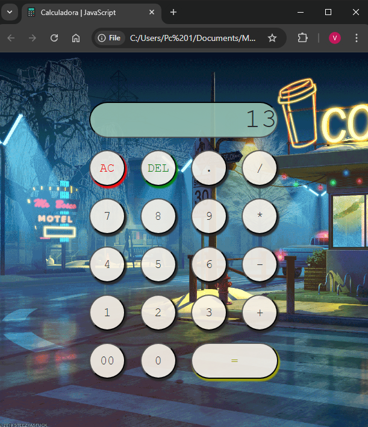

# Calculadora Simples | ➕ ➖ ✖️ ➗ 

Uma calculadora simples desenvolvida em JavaScript, HTML e CSS. Este projeto tem como objetivo demonstrar a manipulação do DOM e conceitos básicos de programação web.

## Funcionalidades

- Realiza operações matemáticas básicas: adição, subtração, multiplicação e divisão.
- Interface amigável e responsiva.
- Entrada de números e operações através de botões.

## Como Usar

1. Clone o repositório:
   ```bash
   git clone https://github.com/victor-galiza/exercicios-universidade.git

2. Navegue até a pasta da calculadora:
   ```bash
    cd exercicios-universidade/calculadora-simples-com-javascript

4. Abra o arquivo _index.html_ em seu navegador.
   
5. Utilize os botões para realizar cálculos. O resultado será exibido na tela.

## Tecnologias Utilizadas
**HTML**: Estruturação da página.
**CSS**: Estilização da interface.
**JavaScript**: Lógica da calculadora e manipulação do DOM.

## Capturas de Tela


## Contribuições
Contribuições são bem-vindas! Sinta-se à vontade para abrir issues ou enviar pull requests.

## Licença
Este projeto está licenciado sob a Licença MIT.
